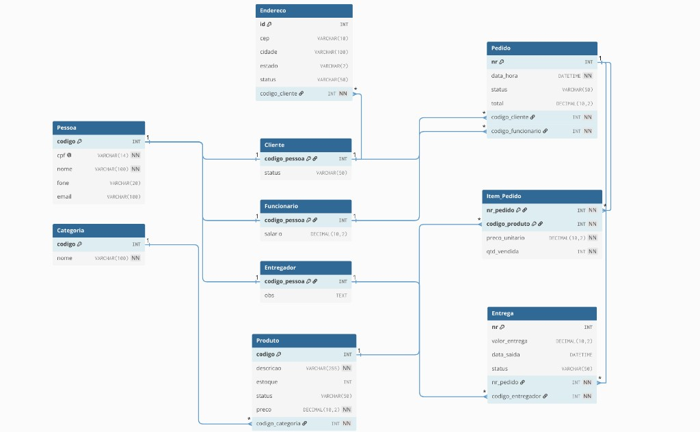

<div align="center">

# Sistema de Pedidos
### Gestão de loja de suplementos · Desktop · Java + SQL Server

Aplicação CRUD desktop para controle de clientes, equipe, catálogo, pedidos, entregas e itens de venda.

<br/>

[](https://openjdk.org/)
[](https://www.microsoft.com/sql-server)
[](https://docs.oracle.com/javase/tutorial/uiswing/)
[](https://netbeans.apache.org/)

<br/>

</div>

---

## Sobre o projeto

Sistema de gestão desenvolvido em **Java Swing** com persistência em **Microsoft SQL Server**, seguindo o padrão **DAO/DTO**. Cobre o ciclo completo de cadastro (criar, listar, alterar e excluir) das entidades do domínio de uma loja de suplementos: pessoas (cliente, funcionário, entregador), produtos, pedidos, itens do pedido (relacionamento **N:N**) e entregas.

| | |
|---|---|
| **Classe principal** | `VIEW.telaprincipal` |
| **Banco de dados** | `sistema_pedidos` |
| **Script SQL (oficial)** | [`sqlserver.sql`](sqlserver.sql) · [`database.sql`](database.sql) |
| **Repositório** | https://github.com/kevinbarbim/sistema-pedidos-suplementos-sqlserver |
| **Diagrama ER** | [`modelagem-banco.png`](modelagem-banco.png) |
| **Conector JDBC** | `mssql-jdbc-12.6.1.jre11.jar` |

---

## Pré-requisitos

| Software | Uso |
|----------|-----|
| **JDK 17** | Compilação e execução |
| **Apache NetBeans** | IDE recomendada (Ant + GUI Builder) |
| **SQL Server** (Express ou Developer) | Instância local na porta `1433` |
| **SSMS** ou **Azure Data Studio** | Execução do script `sqlserver.sql` |

> Habilite autenticação SQL (`sa`) ou ajuste a URL em `ConexaoDAO.java` para o seu ambiente.

---

## Início rápido

### 1. Banco de dados

Inicie o SQL Server e execute `sqlserver.sql` (ou `database.sql`) no SSMS:

```text
SSMS → Arquivo → Abrir → sqlserver.sql → Executar (F5)
```

### 2. Driver JDBC e conexão

O JAR `mssql-jdbc-12.6.1.jre11.jar` já vem na raiz do projeto (clone pronto para NetBeans).

Se o arquivo não existir, execute: `.\download-jdbc.ps1`

Edite `src/DAO/ConexaoDAO.java`: usuário `sa` e senha da sua instância (`localhost:1433`, banco `sistema_pedidos`).

### 3. Executar

```text
NetBeans → Abrir projeto → Clean and Build (Shift+F11) → Run (F6)
```

<details>
<summary><strong>Executar via terminal (PowerShell)</strong></summary>

```powershell
cd "C:\caminho\sistema-pedidos-suplementos-sqlserver"

New-Item -ItemType Directory -Force build\classes | Out-Null
javac -encoding UTF-8 -cp "mssql-jdbc-12.6.1.jre11.jar" -d build\classes `
  (Get-ChildItem -Recurse src -Filter *.java).FullName

New-Item -ItemType Directory -Force build\classes\VIEW | Out-Null
Copy-Item src\VIEW\*.jpg build\classes\VIEW\

java -cp "build/classes;mssql-jdbc-12.6.1.jre11.jar" VIEW.telaprincipal
```

</details>

---


### Responsabilidades

| Camada | Pacote | Função |
|--------|--------|--------|
| **VIEW** | `VIEW` | Interface Swing; formulários `.form` (NetBeans) |
| **DTO** | `DTO` | Objetos de transferência entre tela e DAO |
| **DAO** | `DAO` | SQL via `PreparedStatement` e JDBC |

### Estrutura do repositório

```text
sistema-pedidos-suplementos/
├── sqlserver.sql                     # Schema + dados (SQL Server)
├── database.sql                      # Mesmo conteúdo
├── download-jdbc.ps1                 # Baixa mssql-jdbc
├── modelagem-banco.png               # Diagrama ER
├── mssql-jdbc-12.6.1.jre11.jar       # Após download-jdbc.ps1
├── src/
│   ├── DAO/          # 10 classes
│   ├── DTO/          # 11 classes
│   └── VIEW/         # Telas .java + .form
├── nbproject/        # Configuração NetBeans
├── build/            # Artefatos de compilação (gerado)
└── dist/             # JAR (gerado)
```

---

## Banco de dados

Modelo relacional da faculdade: banco **`sistema_pedidos`** com **10 tabelas** (não usar o schema antigo `BD_suplementos`).

### Diagrama entidade-relacionamento

<p align="center">
  
</p>

### Tabelas

| Tabela | Descrição |
|--------|-----------|
| `Pessoa` | Dados base: CPF, nome, telefone, e-mail |
| `Cliente` | Subtipo de pessoa + status |
| `Funcionario` | Subtipo + salário |
| `Entregador` | Subtipo + observações |
| `Endereco` | Vinculado ao cliente |
| `Categoria` | Classificação de produtos |
| `Produto` | Estoque, preço, status |
| `Pedido` | Data/hora, total, cliente, funcionário |
| `Item_Pedido` | **N:N** pedido × produto (preço unitário, quantidade) |
| `Entrega` | Vinculada a pedido e entregador |

### Ordem de cadastro (integridade referencial)

```text
Categoria → Produto → Cliente / Funcionário / Entregador
    → Pedido → Item_Pedido → Entrega
```

---

## Telas

### Menu principal

| Módulo | Tela | Pesquisa |
|--------|------|----------|
| Cliente | `frmcliente` | `frmpesquisarcliente` |
| Funcionário | `frmfuncionario` | `frmpesquisarfuncionario` |
| Categoria | `frmcategoria` | `frmpesquisarcategoria` |
| Produto | `frmproduto` | `frmpesquisarproduto` |
| Pedido | `frmpedido` | `frmpesquisarpedido` |
| Item do pedido | `frmitempedido` | `frmpesquisaritempedido` |
| Entregador | `frmentregador` | `frmpesquisarentregador` |
| Entrega | `frmentrega` | `frmpesquisarentrega` |

### Operações padrão

| Ação | Comportamento |
|------|----------------|
| **OK** | Inserir novo registro |
| **Pesquisar** | Abrir tabela de registros |
| **Alterar** | Atualizar registro carregado |
| **Excluir** | Remover registro carregado |

Na pesquisa: selecione uma linha → **OK** → os campos da tela de cadastro são preenchidos automaticamente.

---

## Documentação completa

<details>
<summary><strong>Camada DTO — classes e campos</strong></summary>

| Classe | Herança / relação | Destaque |
|--------|-------------------|----------|
| `PessoaDTO` | — | codigo, cpf, nome, fone, email |
| `ClienteDTO` | extends PessoaDTO | status, `EnderecoDTO` |
| `FuncionarioDTO` | extends PessoaDTO | salario |
| `EntregadorDTO` | extends PessoaDTO | obs |
| `EnderecoDTO` | — | cep, cidade, estado, status |
| `CategoriaDTO` | — | codigo, nome |
| `ProdutoDTO` | — | estoque, preco, codigoCategoria |
| `PedidoDTO` | — | dataHora, total, FKs cliente/funcionário |
| `ItemPedidoDTO` | — | Chave lógica: nrPedido + codigoProduto |
| `EntregaDTO` | — | valorEntrega, dataSaida, FKs |

</details>

<details>
<summary><strong>Camada DAO — operações por classe</strong></summary>

| DAO | Transação | Observação |
|-----|-----------|------------|
| `ConexaoDAO` | — | Conexão JDBC via `DriverManager` |
| `CategoriaDAO` | Não | CRUD direto |
| `ProdutoDAO` | Não | CRUD direto |
| `ClienteDAO` | Sim | Pessoa + Cliente + Endereco |
| `FuncionarioDAO` | Sim | Pessoa + Funcionario |
| `EntregadorDAO` | Sim | Pessoa + Entregador |
| `PedidoDAO` | Sim | Pedido + itens (lista opcional) |
| `ItemPedidoDAO` | Não | PK composta |
| `EntregaDAO` | Não | `data_saida` nullable |

</details>

<details>
<summary><strong>Campos e validações por tela</strong></summary>

| Tela | Campos principais | Status (combo) |
|------|-------------------|----------------|
| Cliente | Dados pessoais + endereço completo | Livre |
| Funcionário | Dados pessoais + salário | — |
| Produto | Descrição, estoque, preço, cód. categoria | Disponível / Indisponível |
| Pedido | Data/hora, total, cód. cliente e funcionário | Pendente, Em preparo, A caminho, Entregue, Cancelado |
| Item pedido | Nr pedido, cód. produto, preço, quantidade | Chave composta manual |
| Entrega | Valor, data saída, nr pedido, entregador | Pendente, Em rota, Entregue, Cancelada |

**Formatos aceitos**

- Data/hora: `yyyy-MM-dd HH:mm:ss` (ex.: `2026-06-02 14:30:00`)
- Valores monetários: vírgula ou ponto (`19,90` ou `19.90`)

</details>

<details>
<summary><strong>Fluxo de exemplo — pedido completo</strong></summary>

1. Cadastrar **Categoria** e **Produto** (anotar códigos).
2. Cadastrar **Cliente** e **Funcionário** (anotar IDs = `codigo` da pessoa).
3. Em **Pedido**, preencher dados e gravar com **OK**; anotar o **Nr** via pesquisa.
4. Em **Item Pedido**, vincular produtos ao nr do pedido (repetir por item).
5. (Opcional) Cadastrar **Entregador** e registrar **Entrega** para o pedido.

> O `PedidoDAO` suporta inserir itens no mesmo commit do pedido; a tela atual envia lista vazia — itens são gerenciados pela tela **Item Pedido**.

</details>

<details>
<summary><strong>Configuração JDBC</strong></summary>

Arquivo: `src/DAO/ConexaoDAO.java`

```java
jdbc:sqlserver://localhost:1433;
  databaseName=sistema_pedidos;
  encrypt=true;trustServerCertificate=true;
  user=sa;password=SuaSenhaAqui
```

| Parâmetro | Padrão |
|-----------|--------|
| Host | `localhost` |
| Porta | `1433` |
| Banco | `sistema_pedidos` |
| Usuário | `sa` |
| Senha | *(definir na instalação do SQL Server)* |

</details>

<details>
<summary><strong>Solução de problemas</strong></summary>

| Sintoma | Solução |
|---------|---------|
| `Must set test.src.dir` | Confirmar `test.src.dir=test` em `nbproject/project.properties` |
| `Could not find main class` | **Clean and Build**; remover `.class` de `src/` e `bin/` |
| `NoClassDefFoundError: telaprincipal$N` | Idem — classes antigas em `src` sobrescrevem o build |
| `Communications link failure` | Verificar se o serviço SQL Server está em execução |
| `Unknown database` | Executar `database.sql` |
| `Access denied` | Ajustar senha na URL do `ConexaoDAO` |
| Fundo da tela principal ausente | Copiar `src/VIEW/*.jpg` → `build/classes/VIEW/` |

**Cache NetBeans (último recurso):** fechar IDE e apagar `%AppData%\Local\NetBeans\Cache\28`.

</details>

<details>
<summary><strong>Notas para desenvolvedores</strong></summary>

- Blocos `//GEN-BEGIN` / `//GEN-END` são gerenciados pelo NetBeans — evite edição manual nesses trechos.
- Campos `public static` em `frm*` permitem preenchimento cruzado com telas de pesquisa.
- Encoding do projeto: **UTF-8** (`source.encoding` em `project.properties`).
- Não versionar `build/`, `dist/` nem arquivos `.class` dentro de `src/`.
- `build.classes.excludes` deve incluir `**/*.class` para não copiar bytecode obsoleto de `src`.

</details>

---

## Stack técnica

| Categoria | Tecnologia |
|-----------|------------|
| Linguagem | Java 17 |
| UI | Java Swing + NetBeans GUI Builder |
| Build | Apache Ant (`build.xml`) |
| Banco | Microsoft SQL Server |
| Acesso a dados | JDBC (`PreparedStatement`) |
| Driver | Microsoft JDBC Driver 12.6 (`mssql-jdbc-12.6.1.jre11.jar`) |

---

## Referência de arquivos

| Tipo | Quantidade |
|------|------------|
| Classes DAO | 10 |
| Classes DTO | 10 |
| Telas de cadastro | 8 |
| Telas de pesquisa | 8 |
| Menu principal | 1 |

---

<div align="center">

**Projeto acadêmico** - CRUD em Java com SQL Server

Desenvolvido para gestão integrada de pedidos em ambiente desktop.

<br/>

<sub>Apache NetBeans · DAO/DTO · SQL Server · 10 tabelas · UTF-8</sub>

</div>
